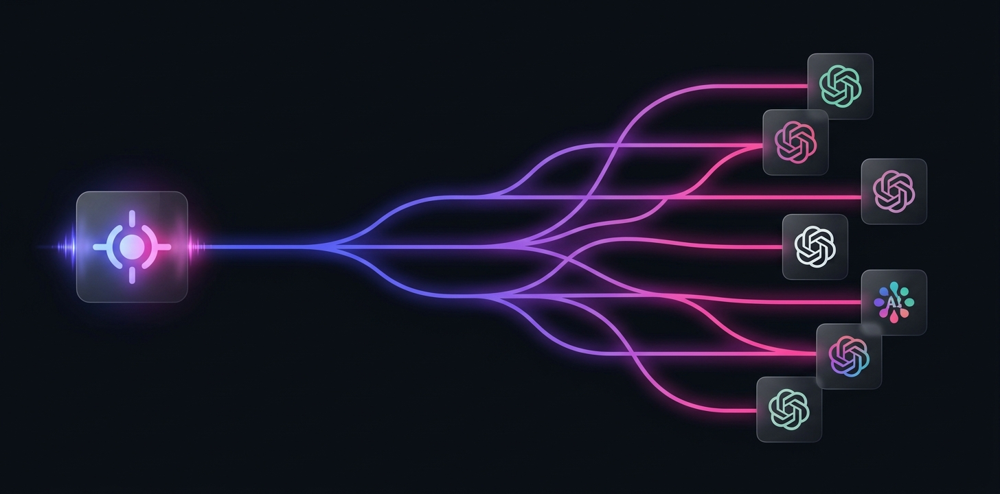

<div align="center">

# NeuronGate API Documentation

The complete guide to integrating with NeuronGate — one API for 50+ AI models.

[](https://neurongate.net)
[](https://neurongate.net/v1)

</div>

---

## Table of Contents

- [Getting Started](#getting-started)
- [Authentication](#authentication)
- [Base URL](#base-url)
- [Chat Completions](#chat-completions)
- [Models](#models)
- [Streaming](#streaming)
- [Error Handling](#error-handling)
- [Rate Limits](#rate-limits)
- [Billing & Payments](#billing--payments)
- [API Keys](#api-keys)
- [OpenAI SDK Compatibility](#openai-sdk-compatibility)
- [Migration Guide](#migration-guide)

---

## Architecture

<div align="center">

<br/><em>One API endpoint → routes to 50+ models across 8+ providers</em>
</div>

---

## Getting Started

### 1. Create an Account

Sign up at [neurongate.net](https://neurongate.net/login?register=true). No credit card required.

### 2. Add Funds

Top up your balance with cryptocurrency:
- **USDT** (TRC-20 or ERC-20)
- **USDC** (ERC-20)
- **ETH** (ERC-20)
- **BTC** (Native)

Minimum top-up: **$5**

### 3. Create an API Key

Go to [API Keys](https://neurongate.net/keys) and generate a key. Your key starts with `ng-`.

### 4. Make Your First Request

```bash
curl https://neurongate.net/v1/chat/completions \
  -H "Authorization: Bearer ng-your-api-key" \
  -H "Content-Type: application/json" \
  -d '{
    "model": "openai/gpt-4o",
    "messages": [
      {"role": "user", "content": "What is NeuronGate?"}
    ]
  }'
```

---

## Authentication

All API requests require a Bearer token in the `Authorization` header:

```
Authorization: Bearer ng-your-api-key
```

API keys can be created and managed at [neurongate.net/keys](https://neurongate.net/keys).

**Key format:** `ng-` followed by a 48-character alphanumeric string.

### Key Scoping

You can create multiple keys for different purposes:
- **Production key** — for your live application
- **Development key** — for testing and development
- **Per-project keys** — isolate usage tracking per project

---

## Base URL

```
https://neurongate.net/v1
```

NeuronGate is fully **OpenAI-compatible**. If you're already using the OpenAI SDK, just change the base URL:

```python
from openai import OpenAI

client = OpenAI(
    base_url="https://neurongate.net/v1",  # ← Only change needed
    api_key="ng-your-api-key"
)
```

---

## Chat Completions

### Endpoint

```
POST /v1/chat/completions
```

### Request Body

| Parameter | Type | Required | Description |
|-----------|------|----------|-------------|
| `model` | string | ✅ | Model ID (e.g., `openai/gpt-4o`, `anthropic/claude-sonnet-4-6`) |
| `messages` | array | ✅ | Array of message objects |
| `temperature` | number | ❌ | Sampling temperature (0-2). Default: 1 |
| `max_tokens` | integer | ❌ | Maximum tokens to generate |
| `stream` | boolean | ❌ | Enable streaming. Default: false |
| `top_p` | number | ❌ | Nucleus sampling parameter |
| `stop` | string/array | ❌ | Stop sequences |
| `frequency_penalty` | number | ❌ | Frequency penalty (-2 to 2) |
| `presence_penalty` | number | ❌ | Presence penalty (-2 to 2) |

### Message Format

```json
{
  "messages": [
    {"role": "system", "content": "You are a helpful assistant."},
    {"role": "user", "content": "Hello!"},
    {"role": "assistant", "content": "Hi! How can I help?"},
    {"role": "user", "content": "What's the weather?"}
  ]
}
```

### Response

```json
{
  "id": "chatcmpl-abc123",
  "object": "chat.completion",
  "created": 1713200000,
  "model": "openai/gpt-4o",
  "choices": [
    {
      "index": 0,
      "message": {
        "role": "assistant",
        "content": "I don't have access to real-time weather data..."
      },
      "finish_reason": "stop"
    }
  ],
  "usage": {
    "prompt_tokens": 25,
    "completion_tokens": 42,
    "total_tokens": 67
  }
}
```

---

## Models

### List Available Models

```
GET /v1/models
```

Returns all available models with pricing information.

### Model ID Format

Models use the format `provider/model-name`:

```
openai/gpt-4o
openai/gpt-4.1
openai/gpt-4.1-nano
openai/gpt-5
anthropic/claude-opus-4.6
anthropic/claude-sonnet-4.6
anthropic/claude-haiku-4.5
google/gemini-2.5-pro
google/gemini-2.5-flash
meta/llama-4-maverick
mistral/mistral-large
deepseek/deepseek-v3
deepseek/deepseek-r1
cohere/command-r-plus
xai/grok-3
```

### Model Categories

| Category | Best Models | Use Case |
|----------|-------------|----------|
| **Chat** | GPT-4o, Claude Sonnet, Gemini Flash | General conversation, Q&A |
| **Reasoning** | o3, DeepSeek R1, Claude Opus | Complex logic, math, analysis |
| **Code** | GPT-4.1, Claude Sonnet, Codestral | Code generation, debugging |
| **Vision** | GPT-4o, Gemini Pro, Claude Sonnet | Image understanding |
| **Fast & Cheap** | GPT-4o-mini, Haiku, Gemini Flash, Nano | High-volume, latency-sensitive |
| **Embedding** | text-embedding-3, Cohere Embed | Vector search, RAG |

**→ [Browse all models with live pricing](https://neurongate.net/models)**

---

## Streaming

Enable server-sent events (SSE) streaming:

```python
stream = client.chat.completions.create(
    model="anthropic/claude-sonnet-4-6",
    messages=[{"role": "user", "content": "Write a poem"}],
    stream=True
)

for chunk in stream:
    if chunk.choices[0].delta.content:
        print(chunk.choices[0].delta.content, end="")
```

### cURL streaming:

```bash
curl https://neurongate.net/v1/chat/completions \
  -H "Authorization: Bearer ng-your-api-key" \
  -H "Content-Type: application/json" \
  -d '{
    "model": "openai/gpt-4o",
    "messages": [{"role": "user", "content": "Write a haiku"}],
    "stream": true
  }'
```

---

## Error Handling

### HTTP Status Codes

| Code | Meaning |
|------|---------|
| `200` | Success |
| `400` | Bad request (invalid parameters) |
| `401` | Unauthorized (invalid or missing API key) |
| `402` | Insufficient balance |
| `429` | Rate limited |
| `500` | Internal server error |
| `503` | Model temporarily unavailable |

### Error Response Format

```json
{
  "error": {
    "message": "Insufficient balance. Please top up at neurongate.net/topup",
    "type": "insufficient_balance",
    "code": 402
  }
}
```

### Handling Errors

```python
try:
    response = client.chat.completions.create(
        model="openai/gpt-4o",
        messages=[{"role": "user", "content": "Hello"}]
    )
except openai.AuthenticationError:
    print("Invalid API key")
except openai.RateLimitError:
    print("Rate limited — back off and retry")
except openai.APIStatusError as e:
    if e.status_code == 402:
        print("Insufficient balance — top up at neurongate.net/topup")
```

---

## Rate Limits

| Tier | Requests/min | Requests/day |
|------|-------------|-------------|
| Free tier | 10 | 100 |
| Standard | 60 | 10,000 |
| Pro ($100+) | 300 | 100,000 |
| Enterprise | Custom | Custom |

Rate limit headers are included in every response:

```
X-RateLimit-Limit: 60
X-RateLimit-Remaining: 57
X-RateLimit-Reset: 1713200060
```

---

## Billing & Payments

<div align="center">

</div>

### Supported Cryptocurrencies

| Currency | Network | Min Top-up |
|----------|---------|-----------|
| USDT | TRC-20, ERC-20 | $5 |
| USDC | ERC-20 | $5 |
| ETH | Ethereum | $5 |
| BTC | Bitcoin | $10 |

### How Billing Works

1. **Top up** your balance at [neurongate.net/topup](https://neurongate.net/topup)
2. **Usage is deducted** from your balance in real-time
3. **No surprise bills** — when balance hits $0, requests return 402
4. **Detailed logs** — every request logged with model, tokens, and cost

### Viewing Usage

- **Dashboard:** [neurongate.net/dashboard](https://neurongate.net/dashboard)
- **Usage logs:** [neurongate.net/usage](https://neurongate.net/usage)
- **Invoices:** [neurongate.net/invoices](https://neurongate.net/invoices)

---

## API Keys

### Create a Key

```
POST /api-keys
```

### List Keys

```
GET /api-keys
```

### Delete a Key

```
DELETE /api-keys/:id
```

Keys can also be managed through the [web dashboard](https://neurongate.net/keys).

---

## OpenAI SDK Compatibility

NeuronGate works as a **drop-in replacement** for the OpenAI API. Any code written for OpenAI works with NeuronGate — just change the base URL.

### Python

```python
from openai import OpenAI

client = OpenAI(
    base_url="https://neurongate.net/v1",
    api_key="ng-your-api-key"
)
```

### JavaScript / TypeScript

```typescript
import OpenAI from 'openai';

const client = new OpenAI({
  baseURL: 'https://neurongate.net/v1',
  apiKey: 'ng-your-api-key',
});
```

### LangChain

```python
from langchain_openai import ChatOpenAI

llm = ChatOpenAI(
    base_url="https://neurongate.net/v1",
    api_key="ng-your-api-key",
    model="anthropic/claude-sonnet-4-6"
)
```

### LlamaIndex

```python
from llama_index.llms.openai import OpenAI

llm = OpenAI(
    api_base="https://neurongate.net/v1",
    api_key="ng-your-api-key",
    model="google/gemini-2.5-pro"
)
```

---

## Migration Guide

### From OpenAI

```diff
  from openai import OpenAI

  client = OpenAI(
+     base_url="https://neurongate.net/v1",
+     api_key="ng-your-api-key"
-     api_key="sk-your-openai-key"
  )

  # Everything else stays the same!
  response = client.chat.completions.create(
      model="openai/gpt-4o",
      messages=[{"role": "user", "content": "Hello!"}]
  )
```

### From Anthropic

```diff
- from anthropic import Anthropic
- client = Anthropic(api_key="sk-ant-...")
- response = client.messages.create(...)

+ from openai import OpenAI
+ client = OpenAI(
+     base_url="https://neurongate.net/v1",
+     api_key="ng-your-api-key"
+ )
+ response = client.chat.completions.create(
+     model="anthropic/claude-sonnet-4-6",
+     messages=[{"role": "user", "content": "Hello!"}]
+ )
```

The advantage: you can now switch between **any provider** by just changing the `model` parameter. No SDK changes. No code refactoring.

---

## Support

- 📧 Email: support@neurongate.net
- 💬 Discord: [discord.gg/neurongate](https://discord.gg/neurongate)
- 🐦 Twitter: [@neurongate](https://twitter.com/neurongate)

---

<div align="center">
<sub>© 2026 NeuronGate. Built for developers who want freedom of choice.</sub>
</div>
